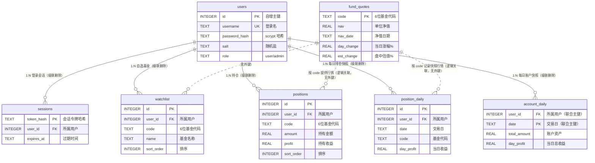

# fund-watch-web · 基金助手

一个**前后端一体的基金助手项目**：

| 部分 | 说明 |
|---|---|
| **前端（v2 主体）** | React 19 + Vite 8 + Tailwind 4 的移动端 UI，完整复刻「基金助手」11 张操作截图（账本 / 自选 / 搜索 / 详情 / 持仓编辑 / 账本设置） |
| **后端** | 零依赖 Node 服务：天天基金数据代理（搜索 / 净值 / 盘中估值 / 详情）、账号系统（scrypt + HttpOnly Cookie）、SQLite 自选持久化、后台管理、本地调试二维码 |

> UI 提示词与设计令牌来源：[`../基金助手-UI提示词/`](../基金助手-UI提示词/)（11 份，含逐像素取色的色值规范）
> v1 时期的后端完整文档（含部署、持久化细节、FAQ）保留在 [`docs/backend-v1.md`](docs/backend-v1.md)；归档版单页 UI 在 [`legacy/index.html`](legacy/index.html)

---

## 🚀 快速开始

```bash
pnpm install

# ★ 一键启动前后端（推荐）
pnpm start                    # 后端 8787 + 前端 5173，就绪后打印横幅与手机扫码二维码
pnpm start --open             # 顺便自动打开浏览器
pnpm start --no-qr            # 不打印二维码
PORT=9000 WEB_PORT=5174 pnpm start    # 自定义端口

# 单独启动（排查问题时可拆开）
pnpm dev                      # 仅前端 → http://127.0.0.1:5173（未启动后端时账号页面为空态、行情显示「—」）
pnpm dev:api                  # 仅后端 → http://127.0.0.1:8787

# 生产构建与部署
pnpm build                    # → dist/
pnpm preview                  # 本地预览构建产物
pnpm deploy                   # vercel deploy --prod（需已安装 vercel CLI）
```

**`pnpm start` 做了什么**（`scripts/dev-all.mjs`，零依赖）：
1. 端口预检（TCP 连接探测，占用则给出可操作提示，而不是启动到一半才报错）
2. 并行拉起后端与前端，日志带 `[api]` / `[web]` 前缀便于区分
3. **等两边真正就绪**（`/api/health` 与首页都返回）后才打印横幅，不靠 sleep 猜
4. 横幅含：前端/后端地址、**手机局域网地址**、数据库持久化状态与数据量、管理员账号
5. 打印**终端二维码**（指向前端 5173，服务端已代理 `/api`，所以手机只需访问这一个地址）
6. Ctrl+C 或任一进程退出 → **同时结束另一个**，不留残留进程

**打开哪个地址？**
| 地址 | 内容 |
|---|---|
| `http://localhost:5173` | **新版 React UI**（本工程主体） |
| `http://localhost:5173/admin.html` | **后台管理页**（管理员；也可在「我的」页点「后台管理」新标签页打开） |
| `http://localhost:8787` | 后端 API + **归档版单页 UI**（v1 界面，保留可用） |
| `http://<局域网IP>:5173` | 手机访问（`pnpm start` 已打印二维码，扫码即用） |
| `http://localhost:8787/__qr` | 放大版二维码页面 |

> 默认管理员：`root` / `root`（首次启动自动写入 SQLite）；公开部署前请用 `ADMIN_PASSWORD` 覆盖或在后台改密。

---

## 📁 目录结构（合并后）

```
fund-watch-web/
├── index.html                  # 前台入口（Vite）
├── admin.html                  # 后台管理入口（独立多页应用）
├── vite.config.mts             # Vite 配置：双入口、/api → 8787 代理、watcher 忽略临时文件
├── tsconfig.json  package.json  pnpm-workspace.yaml  vercel.json
├── src/                        # ── 前端（React）
│   ├── main.tsx  App.tsx       #   挂载 + 路由表（8 条路由）
│   ├── index.css               #   Tailwind 4 @theme 设计令牌
│   ├── data/sources.ts         #   详情页数据源定义（盘中估值 / 最新净值 / 累计净值）
│   ├── lib/api.ts              #   接口客户端（类型化的 api.*，统一错误处理）
│   ├── lib/useMarketData.ts    #   行情 hook（/api/estimate + /api/nav，60s 自动刷新）
│   ├── state/auth.tsx          #   账号状态（登录/注册/退出，离线标记）
│   ├── state/store.tsx         #   持仓 / 自选 / 排序状态（全部来自后端接口）
│   ├── components/             #   手机外框、导航栏、TabBar、色块、弹窗、浮层、下拉刷新、走势图
│   └── pages/                  #   8 个页面（对应 11 张截图 + 我的）
├── src/admin/                  # ── 后台管理页（admin.html：运营数据 + 用户列表）
│   ├── main.tsx  AdminApp.tsx
├── api/                        # ── 后端（Vercel Serverless 函数，CommonJS）
│   ├── search.js  nav.js  estimate.js  detail.js
│   ├── auth/[action].js        #   注册/登录/登出/我的
│   ├── watchlist/…             #   自选增删查
│   └── admin/…                 #   后台统计/用户/删除/改密
├── server/                     # ── 后端核心（CJS）
│   ├── db.cjs                  #   node:sqlite 建表迁移 + 路径探测 + WAL 三重落盘
│   ├── auth.cjs                #   scrypt 哈希、会话、Cookie、内置管理员
│   └── handlers.cjs            #   业务处理器
├── scripts/                    # ── 工具与测试
│   ├── dev-all.mjs             #   ★ 一键启动前后端（端口预检/就绪等待/日志前缀/二维码/联动退出）
│   ├── dev-server.mjs          #   后端调试服务器（静态[归档 UI] + /api + SQLite + 扫码二维码）
│   ├── qr.mjs  db-tool.mjs     #   零依赖二维码编码器 / 数据库运维
│   ├── shoot.mjs               #   前端逐页截图（与参考截图比对）
│   └── test-*.mjs  smoke-*.cjs  qr-*.mjs
├── legacy/index.html           # 归档版单页 UI（v1，84KB，仍由 8787 提供服务）
├── docs/backend-v1.md          # v1 后端完整文档（归档）
├── data/fundwatch.db           # 本地 SQLite（自动创建，已忽略）
└── shots/                      # 自检截图（pnpm shoot 生成，已忽略）
```

---

## 🖥️ 前端：8 个路由 = 11 张截图 + 我的

底部 TabBar 三个 Tab：**账本 / 自选 / 我的**。

| 路由 | 页面 | 对应提示词 | 数据来源与交互 |
|---|---|---|---|
| `/` | 账本主页 | `主页-1.md` | 持仓来自账号；**涨跌幅与当日收益接真实行情**（当日收益 = 金额×涨幅，估算）；每行两段式排版：第一行基金名称、第二行「已更新 + 持有金额 + 持仓收益率」；右侧固定两列（当日收益 / 当日涨幅色块）；**当日收益 / 当日涨幅 / 收益率均可点击表头排序**；⊕ 操作浮层、**点击持仓行进入该基金详情页** |
| ↳ 浮层 | 账本操作菜单 | `主页-2.md` | 同步/添加/修改/账本设置，无遮罩、点外部收起 |
| `/watchlist` | 自选 | `自选.md` | **自选存账号（SQLite）**，换设备可见；最新涨幅 = 最新净值涨幅、估算涨幅 = 盘中估值；双列排序、未登录引导、**点击自选行进入该基金详情页** |
| `/mine` | **我的** | 新增（沿用同一设计语言） | 账号中心：头像 / 用户名 / 角色（**管理员在头像栏多一个「后台管理」按钮，新标签页打开独立后台**）；持仓合计与当日收益、我的自选/持仓明细入口、持仓明细、退出登录（**不罗列 id/created_at 等接口字段**） |
| `/search` | 搜索 | `搜索-1.md` `搜索-2.md` | **实时搜索 `/api/search`**；「＋自选」登录后写入账号（未登录点按会引导登录）；接口失败显示空态提示 |
| `/fund/:code` | 基金详情 | `详情.md` | **真实数据**：净值走势（近 240 交易日）/ 阶段收益 / 费率 / 起购（`/api/detail`）+ 盘中估值（`/api/estimate`）+ 最新净值与当日涨幅（`/api/nav`） |
| ↳ 弹窗 | 数据源切换 | `数据源.md` | 单选 + 取消/确定；三个选项分别对应 **盘中估值 / 最新净值 / 累计净值**的真实字段，切换即改变指标与走势卡口径 |
| `/add` | 添加持仓 | `账本-添加持仓.md` | 基金选择器、三项校验后激活「完成」、写回账本 |
| `/edit` | 修改持仓 | `账本-修改持仓-1.md` | ✕ 删除（确认）、点卡片**行内展开**编辑、`⌃ 收起` |
| ↳ 展开 | 行内编辑卡 | `账本-修改持仓-2.md` | 三行浅灰字段可编辑 |
| `/settings` | 账本设置 | `账本-账本设置.md` | 置顶/上移/下移（首末行自动禁用）、多选+全选+批量删除 |

- **账号系统**：注册/登录/退出（scrypt 密码哈希 + HttpOnly Cookie 会话）；入口为底部「我的」Tab 与各页登录引导（自选提示条、未登录空态、添加持仓页）
- **页面结构**：账本 / 自选 / 我的 **三页顶部均无标题区**，内容直接开始；导航由底部 TabBar（账本 / 自选 / 我的）承载，**搜索入口**在账本 ⊕ 菜单与自选 ⚙ 菜单的「搜索基金」项
- **「我的」页展示口径**：账号信息取自登录会话（`/api/auth/me`），但只呈现用户可读内容（头像、用户名、角色），**不显示 `id` / `created_at` 等接口字段，也不显示技术性说明文案**；管理员会额外按会话 `role` 拉取 `/api/admin/stats`
- **设计令牌**：主蓝 `#1977FF`、涨红 `#E8303C`、跌绿 `#1C9574`、页面底 `#F5F6FA`、禁用按钮 `#9DC4FD`…… 全部在 `src/index.css` 的 `@theme` 中，来源为截图像素取色
- **自适应**：手机宽度全屏铺满；桌面端居中显示 393×852 手机机身；**矮视口（横屏手机、小窗口）自动退化为全屏铺满**，避免固定机身高度裁掉底部 TabBar
- **已剔除的仿制元素**：模拟 iOS 状态栏与「基金助手」标题栏（88pt）、三页顶部标题头图、详情页推广 banner（“证券开户…”广告条）

### 真实数据接入一览
| 页面/组件 | 接口 | 用途 |
|---|---|---|
| 搜索页 / 添加持仓选择器 | `/api/search` | 关键词实时搜索基金 |
| 账本主页 / 自选页 | `/api/estimate` + `/api/nav` | 盘中估算涨幅、最新净值涨幅（批量估值 + 逐只取最新净值） |
| 基金详情 | `/api/detail` | 净值走势、阶段收益、费率、起购金额 |
| 基金详情 | `/api/holdings` | **重仓股**（东财基金持仓明细 + 批量股票行情，含季度与截止日） |
| 基金详情 / 搜索 / 自选 | `/api/estimate`、`/api/nav`、`/api/watchlist` | 估值、净值、自选增删查 |
| 账号 | `/api/auth/*` | 注册 / 登录 / 登出 / 当前用户 |
| **自选** | `/api/watchlist` `GET/POST/DELETE` | 账号自选落库（SQLite） |
| **持仓** | `/api/positions` `GET/POST/DELETE`、`/api/positions/reorder` | 账号持仓落库 + 排序（SQLite） |
| 我的（管理员） | `/api/admin/stats`、`/api/admin/users` | 头像栏「后台管理」按钮 → 新标签页打开 `/admin.html` 查看运营数据 |

### 后台管理页（`/admin.html`）
独立的多页应用入口（Vite 多页构建，桌面布局），管理员在「我的」页头像栏点「后台管理」以**新标签页**打开：

| 区块 | 内容 |
|---|---|
| 顶栏 | 「基金助手 · 后台管理」+ 当前管理员（用户名/角色）+ 退出 + 返回前台 |
| 系统运营数据 | 10 个指标卡，按 **账号 / 自选 / 账本 / 数据** 四组着色：注册用户、管理员、活跃会话、自选条数、有自选用户、持仓条数、有持仓用户、行情缓存、快照天数（含最新快照日期）、每日明细行；`60s 自动刷新` + 手动刷新；**每张卡片可点击下钻查看明细**（见下） |
| **指标明细下钻** | 点击任一指标卡 → 弹层展示该指标的**构成明细**（列定义由后端返回，前端通用渲染）：<br>· 账号：用户列表（ID/用户名/角色/注册时间）、管理员、活跃会话（建立/过期/剩余天数）<br>· 自选：全部自选记录（用户/代码/名称/加入时间）、按用户聚合的自选条数<br>· 账本：全部持仓（用户/代码/名称/金额/收益/时间）、按用户聚合的持仓只数与金额合计<br>· 数据：行情缓存（代码/净值/净值日期/当日涨幅/盘中估值/抓取时间）、快照天数按交易日聚合（用户数/资产合计/当日收益合计）、每日明细行（交易日/用户/代码/涨跌幅/当日收益）<br>明细总数与卡片数值**同源同口径**（`test:admin` 有 10 项一致性断言）；手机端弹层自适应、表格可横向滑动 |
| 用户列表 | `id / 用户名 / 角色 / 自选数 / 活跃会话 / 注册时间` + **操作**列，支持按用户名搜索（`/api/admin/users`）；**PC/平板为表格，手机自动切换为卡片列表** |
| **重置登录密码** | 行内「重置密码」→ 弹层输入新密码（可**一键随机生成** 12 位）→ 二次确认；成功后弹层**保持打开并回显新密码**（便于复制转达），该用户既有会话立即失效 |
| **级联删除用户** | 行内「删除」→ 弹层列出将被级联清理的数据（登录会话 / 自选 N 条 / 持仓与每日快照）→ **输入用户名二次确认**后执行；数据库 `ON DELETE CASCADE` 会一并清理 `sessions` / `watchlist` / `positions` / `position_daily` / `account_daily`。管理员账号与当前登录账号的删除按钮为禁用态（后端同样拒绝） |
| 自适应 | **手机（≤640px）**：顶栏换行、指标卡 2 列、用户列表卡片式；**平板（641–1023px）**：指标卡 3 列、表格（容器可横向滚动）；**PC（≥1024px）**：指标卡 5 列、完整表格。三档均实测无横向溢出 |
| 未登录 | 页内提供**管理员登录表单**（同一套 `/api/auth/*` 与会话 Cookie），无需回到前台 |
| 已登录但非管理员 | 显示「需要管理员权限」，可一键切换账号 |

> 权限完全由会话中的 `users.role` 决定：`/api/admin/*` 对普通用户返回 403，页面也会拦截。
> 用户列表按视口**只渲染一套布局**（≥768px 表格 / ＜768px 卡片），避免重复 DOM 让选择器命中隐藏节点。

- **登录 + 后端可用时，以上页面数据全部来自后端接口**；**未登录时不展示任何静态/演示数据**——账本、自选、我的均为空态并给出登录引导，搜索/详情在接口失败时显示「—」或空态提示，绝不回落到硬编码数据
- **行情默认 60 秒自动刷新**（账本 / 自选；页面不可见时跳过），两页同时支持**下拉刷新**（触摸与鼠标拖拽均可）：下拉 → `松开立即刷新` → `正在刷新…` → `刷新完成 · HH:MM`；下拉会同时刷新「行情 + 账号列表（自选/持仓）」

---

## 🔌 前端 ↔ 后端连接方式

```
开发：  浏览器 → vite:5173 ──/api 代理──→ node:8787 ──→ 天天基金公开接口
生产：  浏览器 → Vercel 静态(dist) ──/api 同源──→ Vercel Serverless(api/**)
```
- 前端所有请求都写相对路径 `/api/...`，**开发与生产同一套代码**
- **已接入真实数据**：搜索、账本涨跌幅、自选（含账号落库）、基金详情（走势/阶段收益/费率）
- **口径说明**：当日收益按「持有金额 × 当日涨幅」估算（上游不提供逐日盈亏，界面已标注）；盘中估值仅在交易时段可用，其余时间显示「—」；以上均取自真实接口，页面不存放任何硬编码行情

---

## 🧪 测试与自检

```bash
# 后端（全部本地可跑，自带临时数据库，不污染 data/）
pnpm test:docs          # 文档一致性：README 的 ER 图/字段说明 vs 真实建表语句：43 项断言
pnpm test:auth          # 账号/自选/会话：20 项断言
pnpm test:admin         # 后台权限/用户管理/运营统计 + 级联删除验证（会话/自选/持仓/快照）+ 10 项指标明细一致性：60 项断言
pnpm test:portfolio     # 账本服务：账户资产/当日收益算术、每日快照落库、行情缓存、重启仍在：28 项断言
pnpm test:persistence   # 重启/崩溃/单文件迁移不丢数据：11 项断言
pnpm test:api           # 数据接口回归（联网）
pnpm test:qr            # 自研二维码编码器 vs 权威库：1280/1280 位一致
pnpm test:qr:decode     # jsQR 真实解码：20/20

# 前端 + 联调（真实浏览器跑，自带临时后端与前端）
pnpm test:live          # 未登录无静态数据 → 注册 → 落库 → 下拉/60s 刷新 → 行点击跳详情 → 我的 → 重仓股 → 管理员后台 + 后台页三档自适应 + 重置密码/级联删除 + 指标下钻明细 + 持仓收益率与排序 → 重启仍在：107 项断言
pnpm test:overflow      # 横向溢出与裁切回归：12 种视口（含安卓横屏）× 9 个页面：216 项断言

# 归档版 UI（v1 单页界面，由 8787 提供）
pnpm test:legacy:e2e  test:legacy:auth-ui  test:legacy:admin-ui
pnpm test:legacy:mobile  test:legacy:responsive
# 注：test:legacy:e2e 需先启动 `pnpm dev:api`（8787）；其余自带临时服务器，可独立运行

# 前端
pnpm typecheck          # TS 类型检查
pnpm build              # 生产构建
pnpm shoot              # 逐页截图 → shots/（需 Chromium，见下）
```

### 前端逐页截图（还原度自检）
```bash
pnpm start & pnpm preview ; node scripts/shoot.mjs    # 12 页 → shots/*.png
```
- 账本/自选等页面属于**账号数据**：截图前脚本会通过**真实接口**注册一个演示账号并写入持仓与自选（不使用静态数据）；后端未启动时会提示并截取空态
- 截图脚本不把 puppeteer 装进项目依赖（避免 pnpm 构建脚本拦截问题），按环境变量找依赖与浏览器：
```powershell
$env:NODE_PATH="<含 puppeteer 的 node_modules>"
$env:PUPPETEER_EXECUTABLE_PATH="<chrome.exe 路径>"
node scripts/shoot.mjs
```

---

## 🗄️ 数据层：库表、字段业务含义与关系

存储：**SQLite**（Node 内置 `node:sqlite`，零 npm 依赖）；库文件默认 `data/fundwatch.db`，可用 `DB_PATH` 指定。
共 **7 张表**：3 张账号业务表（`users` / `watchlist` / `positions`）+ 3 张账本衍生表（`fund_quotes` / `position_daily` / `account_daily`）+ 1 张会话表（`sessions`）。

### 表关系图（ER）



> 实线 `||--o{` = 真实外键（`ON DELETE CASCADE`，删用户即连带清理其数据）；虚线 `||..o{` = **逻辑关联**：行情表以 `code` 为主键、不建外键，因此可以独立于任何用户先缓存行情，用户的持仓/自选删除也不会影响行情缓存。

### 1. `users` —— 账号

| 字段 | 类型 | 约束 / 默认 | 业务含义 |
|---|---|---|---|
| `id` | INTEGER | PK，自增 | 用户唯一标识；`1` 为内置管理员 |
| `username` | TEXT | NOT NULL，UNIQUE | 登录名（3–20 位，字母/数字/中文/下划线/连字符） |
| `password_hash` | TEXT | NOT NULL | 口令的 **scrypt** 派生值（64 字节），**不存明文** |
| `salt` | TEXT | NOT NULL | 每用户独立随机盐（16 字节），与口令一起参与派生 |
| `role` | TEXT | NOT NULL，默认 `user` | 角色：`user` 普通用户 / `admin` 管理员（决定能否调用 `/api/admin/*`） |
| `created_at` | TEXT | NOT NULL | 注册时间（ISO 8601，UTC） |

### 2. `sessions` —— 登录会话

| 字段 | 类型 | 约束 / 默认 | 业务含义 |
|---|---|---|---|
| `token_hash` | TEXT | PK | 会话令牌的 **SHA-256 哈希**；明文令牌只存在于浏览器 HttpOnly Cookie，库中不可反推 |
| `user_id` | INTEGER | NOT NULL，FK → `users.id`，级联删除 | 会话归属用户 |
| `created_at` | TEXT | NOT NULL | 会话创建时间 |
| `expires_at` | TEXT | NOT NULL（索引 `idx_sessions_user`） | 过期时间（默认 30 天）；过期会话在写入路径顺带清理，`管理员后台` 的「活跃会话」按其统计 |

### 3. `watchlist` —— 自选基金

| 字段 | 类型 | 约束 / 默认 | 业务含义 |
|---|---|---|---|
| `id` | INTEGER | PK，自增 | 行标识 |
| `user_id` | INTEGER | NOT NULL，FK → `users.id`，级联删除 | 自选归属用户（**自选是账号级数据**） |
| `code` | TEXT | NOT NULL，`UNIQUE(user_id, code)` | 6 位基金代码；同一用户不可重复自选 |
| `name` | TEXT | NOT NULL，默认 `''` | 基金名称快照（列表首屏即可展示，无需等行情接口） |
| `sort_order` | INTEGER | NOT NULL，默认 `0`（索引 `idx_watchlist_user`） | 自选排序位（置顶/上移/下移即重排此列） |
| `created_at` | TEXT | NOT NULL | 加入自选的时间 |

### 4. `positions` —— 持仓（账本）

| 字段 | 类型 | 约束 / 默认 | 业务含义 |
|---|---|---|---|
| `id` | INTEGER | PK，自增 | 行标识 |
| `user_id` | INTEGER | NOT NULL，FK → `users.id`，级联删除 | 持仓归属用户 |
| `code` | TEXT | NOT NULL，`UNIQUE(user_id, code)` | 6 位基金代码；同一基金在账本中只有一条（新增即 upsert 覆盖） |
| `name` | TEXT | NOT NULL，默认 `''` | 基金名称快照 |
| `amount` | REAL | NOT NULL，默认 `0`，≥ 0 校验 | **持有金额**（元）——「账户资产」的加总来源 |
| `profit` | REAL | NOT NULL，默认 `0` | **持有收益**（元，可负）——用户录入的累计盈亏 |
| `sort_order` | INTEGER | NOT NULL，默认 `0`（索引 `idx_positions_user`） | 账本排序位（账本设置页的置顶/上移/下移） |
| `created_at` | TEXT | NOT NULL | 建仓记录时间 |

### 5. `fund_quotes` —— 行情缓存（按基金代码，唯一）

| 字段 | 类型 | 约束 / 默认 | 业务含义 |
|---|---|---|---|
| `code` | TEXT | PK | 6 位基金代码（行情以代码为唯一键，与用户无关） |
| `name` | TEXT | NOT NULL，默认 `''` | 上游返回的基金名称 |
| `nav` | REAL | 可空 | **单位净值**（最新公布值） |
| `nav_date` | TEXT | 可空 | 净值所属交易日 `YYYY-MM-DD`——决定「当日」口径的快照日期 |
| `day_change` | REAL | 可空 | **当日涨幅 %**（最新净值日涨幅 `jzzzl`）——「当日收益」的乘数 |
| `acc_nav` | REAL | 可空 | **累计净值**（详情页数据源之二） |
| `est_change` | REAL | 可空 | **盘中估算涨幅 %**（天天基金实时估值，仅交易时段有值） |
| `est_time` | TEXT | 可空 | 估值时间（如 `2026-09-16 14:30`） |
| `estimate_available` | INTEGER | NOT NULL，默认 `0` | 盘中估值是否可用（`0/1`）：为 0 时前端「盘中估值」显示 `—`，不伪造数据 |
| `updated_at` | TEXT | NOT NULL | 本地抓取时间——**缓存 TTL 判据**（默认 60s 内不重复请求上游） |

### 6. `position_daily` —— 每只持仓的每日快照

| 字段 | 类型 | 约束 / 默认 | 业务含义 |
|---|---|---|---|
| `id` | INTEGER | PK，自增 | 行标识 |
| `user_id` | INTEGER | NOT NULL，FK → `users.id`，级联删除 | 归属用户 |
| `date` | TEXT | NOT NULL，`UNIQUE(user_id, date, code)` | 交易日 `YYYY-MM-DD`（取该基金**最新净值日期**，非本地时钟） |
| `code` | TEXT | NOT NULL | 6 位基金代码 |
| `name` | TEXT | NOT NULL，默认 `''` | 当日名称快照 |
| `amount` | REAL | NOT NULL，默认 `0` | 当日该持仓的**持有金额**快照（后续改金额不会改写历史） |
| `profit` | REAL | NOT NULL，默认 `0` | 当日**持有收益**快照 |
| `nav` | REAL | 可空 | 当日单位净值 |
| `day_change` | REAL | 可空 | 当日涨幅 %（计算当日收益所用值） |
| `est_change` | REAL | 可空 | 当日盘中估算涨幅 % |
| `day_profit` | REAL | NOT NULL，默认 `0` | **当日收益（元）** = `amount × day_change / 100`，四舍五入到分 |
| `updated_at` | TEXT | NOT NULL | 该行最近一次重算时间（同一交易日内 upsert 刷新） |

### 7. `account_daily` —— 账户每日快照（收益曲线数据源）

| 字段 | 类型 | 约束 / 默认 | 业务含义 |
|---|---|---|---|
| `user_id` | INTEGER | NOT NULL，FK → `users.id`，级联删除，**与 `date` 组成主键** | 归属用户 |
| `date` | TEXT | NOT NULL，PK 之一 | 交易日 `YYYY-MM-DD`——同一用户每天一行 |
| `total_amount` | REAL | NOT NULL，默认 `0` | **账户资产**（当日 Σ `positions.amount`） |
| `total_profit` | REAL | NOT NULL，默认 `0` | 持有收益合计 |
| `day_profit` | REAL | NOT NULL，默认 `0` | **当日总收益**（当日 Σ `position_daily.day_profit`） |
| `position_cnt` | INTEGER | NOT NULL，默认 `0` | 当日持仓只数 |
| `watch_cnt` | INTEGER | NOT NULL，默认 `0` | 当日自选只数 |
| `updated_at` | TEXT | NOT NULL | 最近一次重算时间 |

### 数据写入路径（谁写、何时写）

| 表 | 写入时机 |
|---|---|
| `users` / `sessions` | 注册、登录、登出、改密（改密会作废旧会话） |
| `watchlist` | 「＋自选」/ 取消自选 / 自选排序 |
| `positions` | 添加持仓、修改持仓、删除持仓、持仓排序（金额变更走 upsert） |
| `fund_quotes` | 每次 `/api/portfolio`、`/api/quotes` 取行情时；命中 60s 缓存则不写 |
| `position_daily` / `account_daily` | 每次 `/api/portfolio` 按交易日 **upsert**；当天删除的持仓会同步清理其快照行 |

> 每次写操作后都会执行 `PRAGMA wal_checkpoint(TRUNCATE)`，把数据从 WAL 合并回主库文件（详见下一节）。

### 服务（均需登录会话）

| 接口 | 读写 | 说明 |
|---|---|---|
| `GET /api/portfolio` | 读 `positions` + `fund_quotes`，写 `position_daily` + `account_daily` | **账户账本**：账户资产、持有收益、当日总收益、持仓明细（含每只净值/涨幅/当日收益/**持仓收益率 rate**）；`?refresh=1` 强制刷新上游行情 |
| `GET /api/portfolio/history?days=30` | 读 `account_daily` | 账户资产/收益历史（收益曲线数据源） |
| `GET /api/portfolio/daily?date=&days=` | 读 `position_daily` | 持仓每日明细快照（任意已记录日期） |
| `GET /api/quotes?codes=&refresh=` | 读/写 `fund_quotes` | 批量行情（60s 内直接命中缓存） |
| `GET/POST/DELETE /api/positions`、`POST /api/positions/reorder` | 读写 `positions` | 持仓增删改查与排序 |
| `GET/POST/DELETE /api/watchlist`、`POST /api/watchlist/reorder` | 读写 `watchlist` | 自选增删查与排序 |
| `POST /api/auth/*`、`GET /api/auth/me` | 读写 `users` / `sessions` | 注册 / 登录 / 登出 / 当前用户 |
| `GET /api/admin/*` | 读 `users` / `sessions` / `watchlist` / `positions` / `fund_quotes` / 每日快照 | 后台统计、指标明细下钻（`/api/admin/metrics/:key`）与用户管理（按 `users.role` 鉴权） |

**计算口径**（与参考截图一致）：
- 当日涨幅 = 最新净值日涨幅（`fund_quotes.day_change`）；盘中估算涨幅 = `fund_quotes.est_change`（仅交易时段）
- **当日收益 = 持有金额 × 当日涨幅**（`position_daily.day_profit`；上游不提供逐日盈亏，故为估算，界面已标注）
- **持仓收益率 = 持有收益 / 本金**，本金 = 持有金额 − 持有收益（服务端在 `/api/portfolio` 里以 `rate` 返回，本金 ≤ 0 时为 `null`，界面显示 `—` 且排序时置底）
- 账户资产 = Σ 持有金额；当日总收益 = Σ 当日收益（`account_daily`）
- 「当日」以持仓的**最新净值日期**为准（非本地时钟），保证跨周末/节假日口径稳定

前端使用：**账本页**与**我的页**登录后直接读取 `/api/portfolio`（服务端口径 + 落库）；**未登录不展示任何数据**（空态 + 登录引导），接口不可用时显示「—」与提示，不做任何本地推算或硬编码兜底。

---

## 💾 数据持久化（重启不丢）

`server/db.cjs` 的三重落盘保障（v1.4 引入，合并后保持）：
1. **每次写操作后** checkpoint（注册/登录/增删自选/后台改密）
2. **服务启动时** checkpoint —— 兜住任何残留 WAL
3. **优雅退出**（Ctrl+C/SIGINT）checkpoint 并关闭；另设 `wal_autocheckpoint`

⇒ **单个 `fundwatch.db` 文件即含全部数据**，可直接拷贝迁移/备份。

```bash
pnpm db:info         # 路径 · 是否持久化 · 数据量 · 文件大小
pnpm db:backup       # 一致性快照 → data/backups/
pnpm db:checkpoint   # 手动合并 WAL
```
路径优先级：`DB_PATH` 环境变量 → 项目 `data/fundwatch.db`（探测可写性）→ 临时目录（会醒目警告）。
自检接口：`GET /api/health` 返回库路径、是否持久化、用户数与自选数。

---

## 🧭 v2 合并说明（本次变更）

| 变更 | 处理 |
|---|---|
| 前端工程整体迁入 `fund-watch-web` | 根目录现为 Vite 前端；后端 `api/ server/ scripts/` 保持原路径 |
| 后端文件曾被 reset 删除 | 从 git `ca72a01` 精准恢复 34 个文件（未带出旧提交中被跟踪的 `node_modules`） |
| `index.html` 同名冲突 | 前端入口留在根；v1 单页 UI 归档到 `legacy/index.html`，并由 8787 在 `/` 提供服务（旧 UI 测试无需改动） |
| `package.json` 同名冲突 | 合并为一份：前端脚本 `dev/build/preview/typecheck/shoot` + 后端脚本 `dev:api/db:*/test:*/deploy` |
| **后端 `api/*.js` 报 `module is not defined`** | 前端脚手架的 `"type": "module"` 会把 `api/*.js` 当 ESM；已移除根 `type` 字段（后端恢复 CJS 语义），并把 Vite 配置改为显式 ESM 的 `vite.config.mts` |
| `node_modules` 剪切后失效 | pnpm 在 Windows 用 junction（绝对路径），目录搬迁后成死链 → 删除后重装 |
| DSH 供应链策略拦截构建 | `vite` 的传递依赖 `rolldown` 解析到发布不足 24h 的 `1.2.9`，被锁文件级策略拒绝 → 在 `pnpm-workspace.yaml` 固定 `rolldown: 1.2.8`（并设 `minimumReleaseAge: 0`） |
| Vite 监视器 EBUSY 崩溃 | 工具写入时的 `.*.tmpdir/*.tmp` 被监视导致崩溃 → `server.watch.ignored` 显式忽略 |
| Vercel 配置 | 补充 `buildCommand: pnpm build`、`outputDirectory: dist`（部署前端）+ 保留 `api/**` 函数配置 |
| 一键启动前后端 | 新增零依赖 `scripts/dev-all.mjs`（`pnpm start`）：端口预检、就绪等待、日志前缀、二维码、联动退出 |
| 手机调试 | Vite 改为监听局域网（`host: true` + `allowedHosts: true`），二维码指向前端 5173；后端仍只监听本机，由前端代理转发 |
| **前端接真实数据** | 新增 `src/lib/api.ts`（接口客户端）、`useMarketData`（估算+净值批量拉取、60s 刷新）、`src/state/auth.tsx` + `AuthSheet`（注册/登录/退出）；搜索、账本、自选、详情全部接入后端 |
| **自选账号落库** | 自选改为 `/api/watchlist`（乐观更新 + 失败回滚）；未登录时点「＋自选」引导登录，不写入任何本地状态 |
| **剔除仿制 UI** | 去掉每页顶部的模拟 iOS 状态栏与「基金助手」标题栏（顶部改用 `safe-area-inset-top` 适配真机）、去掉详情页推广 banner |
| **后续：三页顶部标题区也剔除** | 见上方「三页顶部标题区剔除」一行 |
| 详情页真实化 | 用 `/api/detail` 的净值走势（近 240 交易日，SVG）替换演示分时图；新增「阶段收益 / 申购费率 / 起购金额」卡片；重仓股票改接 `/api/holdings`（真实季度、股票代码、持仓市值） |
| 新增端到端测试 | `pnpm test:live`（64 项断言）：未登录不含静态数据、三页无顶部标题、注册→自选/持仓落库、下拉刷新与 60s 自动刷新（实测等待 62s 观察自动重取）、真实重仓股、详情页数值与接口逐项比对、我的页账号信息、**管理员后台入口与新标签页后台页**、重启后端仍在 |
| **移除全部静态数据** | 删除 `src/data/mock.ts` 与无引用的 `IntradayChart.tsx`；未登录时账本/自选/我的/添加持仓只显示空态与登录引导（账户资产 0.00），搜索/详情接口失败时显示「—」与空态提示；`shoot.mjs` 改为通过真实接口播种演示账号后截图（12 页） |
| **新增「我的」页** | 底部 TabBar 扩展为 账本 / 自选 / **我的**；展示头像/用户名/角色 + 持仓合计与当日收益 + 我的自选/持仓明细 + 退出登录（不罗列接口字段与技术说明） |
| **管理员后台页** | 新增独立多页入口 `admin.html`（`src/admin/`，桌面布局）：系统运营数据 10 项指标（账号/自选/账本/数据四组）+ 用户列表搜索 + 页内管理员登录 + 60s 自动刷新；「我的」页头像栏为管理员显示「后台管理」按钮并**新标签页**打开；**剔除**原「我的」页内的后台概览栏；`/api/admin/stats` 扩展 holdings/quotes/snapshot 等运营字段 |
| **后台页自适应** | 手机 / 平板 / PC 三档适配：顶栏窄屏换行、指标卡 2→3→5 列、用户列表在手机切换为卡片式（PC 保持表格且容器可横向滚动）；`pnpm test:live` 在 393 / 768 / 1280 三种宽度下断言布局切换与**无横向溢出** |
| **后台用户管理** | 用户列表新增**操作**列：「重置密码」（可随机生成 12 位 + 二次确认，成功后弹层保持打开回显新密码便于转达）与「删除」（列出级联范围 + 输入用户名二次确认）；管理员与当前登录账号的删除按钮为禁用态。列表改为按视口**只渲染一套 DOM**（原先卡片+表格同时存在，隐藏节点的按钮无法点击）。`test:admin` 增加级联删除全链路验证：会话 / 自选 / 持仓 / 每日快照全部清理、统计归零、原 Cookie 立即 401、无法再登录 |
| **运营指标下钻明细** | 新增 `GET /api/admin/metrics/:key`（仅管理员）：10 个指标各自返回**列定义 + 明细行 + 总数**（用户/管理员/会话/自选/自选用户/持仓/持仓用户/行情缓存/快照天数/每日明细行），前端通用渲染成明细表；指标卡改为可点击按钮（带 `aria-label`、hover 提示）。新增 10 项**一致性断言**：每个指标的明细总数必须等于 `/api/admin/stats` 的对应字段 |
| **持仓收益率与排序** | 账本每只持仓新增**收益率**（= 持有收益 / 本金，本金 = 持有金额 − 持有收益；本金 ≤ 0 显示 `—` 并排在最后）；服务端 `/api/portfolio` 直接返回 `rate`，本地兜底路径同样换算；表头支持**当日收益 / 当日涨幅 / 收益率**三处点击升降序（`SortHeader` 补 `aria-label="按XX排序"` 与 `aria-pressed`） |
| **账本列表排版优化** | 原先右侧三列数字紧贴、基金名称被压到只剩 11 字。改为：右侧**只保留当日收益 + 当日涨幅两列**（列宽 84/72px，与表头逐列对齐，间距 `gap-x-3`），**收益率移到第二行右对齐**并带「收益率」字样；行高 56→60px；表头「收益率」排序按钮独立放在左侧（单行紧凑样式，`SortHeader` 的 `date` 变为可选）；「已更新」标签加 `shrink-0 whitespace-nowrap`（修掉被 flex 压成竖排三行的缺陷）。优化后基金名称完整可见、`test:overflow` 216 项仍全绿 |
| **安卓横屏溢出修复** | 定位到根因：手机外框固定 `852px` 高，凡视口矮于 852px（安卓横屏 800×360 / 915×412、平板横屏、PC 1280×800）**底部 TabBar 被裁切**。改为 `height: min(852px, calc(100dvh - 48px))`，并在 `max-height: 600px` 时取消机身装饰全屏铺满；另把详情页三指标字号改为 `clamp(19px,6.4vw,28px)`，修掉 320px 宽下的 8px 内部溢出。新增 `pnpm test:overflow`（12 视口 × 9 页面 = **216 项断言**，含"关键元素未被裁切"检查） |
| **三页顶部标题区剔除** | 账本 / 自选 / 我的 不再有顶部渐变标题头图，内容直接开始；**搜索入口**移入账本 ⊕ 菜单与自选 ⚙ 菜单（「搜索基金」），**账号入口**由「我的」Tab 与各页登录引导承担；同步删除无引用的 `ListHero` / `AccountButton` 组件 |
| **列表行跳详情** | 账本持仓行与自选行均为可点击按钮（含 `aria-label="查看 XX 详情"`），点击进入 `/fund/:code`；下拉刷新组件加 6px 起始死区，避免点按抖动被识别为下拉而吞掉点击 |
| **持仓落库（消除演示数据）** | 新增 `positions` 表 + `/api/positions`（增删改查）与 `/api/positions/reorder`（置顶/上移/下移）；前端持仓改为账号级持久化（乐观更新 + 失败回滚），未登录不展示任何持仓 |
| **真实重仓股** | 新增 `/api/holdings`：解析东财基金持仓明细表 + 批量股票行情补涨跌幅，返回季度/截止日/占比/市值/涨跌幅；详情页「重仓股票」不再是演示数据 |
| **数据源改为真实口径** | 「盘中估值 / 最新净值 / 累计净值」三项分别对应 `/api/estimate` 与 `/api/nav` 的真实字段，切换即改变详情页指标与走势卡口径 |
| **添加持仓真实搜索** | 选择器接入 `/api/search`（无关键词时列出账本已有基金），不再依赖本地演示列表 |
| **刷新体验** | 账本 / 自选默认 **60s 自动刷新**（服务端账本轮询 + 行情 hook 同一间隔）；新增零依赖 `PullToRefresh` 组件（触摸 + 鼠标拖拽），下拉同时刷新行情与账号列表，含「松开立即刷新 / 正在刷新… / 刷新完成 · HH:MM」状态 |
| **账本服务化（库表扩展）** | 新增 `fund_quotes`（行情缓存）/ `position_daily`（每只每日快照）/ `account_daily`（账户每日资产快照）三张表与 `server/market.cjs`、`server/portfolio.cjs` 两个服务模块；新增 `/api/portfolio`、`/api/portfolio/history`、`/api/portfolio/daily`、`/api/quotes`、`/api/watchlist/reorder`；**账户资产与当日收益改为服务端计算并落库**，`/api/estimate`、`/api/nav` 复用同一套上游实现与缓存 |
| preview 代理 | `vite preview` 同样代理 `/api`，构建产物也能本地联调 |

---

## 📌 说明与注意

1. **数据来源规则（无静态数据）**：**未登录**时账本 / 自选 / 我的 / 添加持仓只显示空态与登录引导（账户资产 0.00、无任何示例基金）；**登录后**全部来自后端接口。接口失败时显示「—」与「未连接后端」提示，**不回落到任何硬编码数据**（`src/data/mock.ts` 已删除）。`pnpm test:live` 有专门断言校验未登录页面不含静态数据。
2. **持仓与自选都已落库**：`watchlist` / `positions` 两张表都在 SQLite 中，重启后端数据仍在（`pnpm test:live` 第 8 步会真杀进程再验证）。持仓排序（置顶/上移/下移）与批量删除同样写库。
3. **归档版 UI**：`legacy/index.html` 与 v1 界面一致，仅为保留与回归测试；新功能一律在 `src/` 中开发。
4. **二维码/手机调试**：`pnpm start` 会自动打印终端二维码与局域网地址；若端口被占用，请先结束占用进程或改用 `PORT=9000 WEB_PORT=5174 pnpm start`。
5. **安全**：密码使用 scrypt + 随机盐；会话为 HttpOnly + SameSite=Lax Cookie（生产环境带 Secure）；公开部署前务必改掉默认 `root/root` 并设置 `DB_PATH` 指向持久化卷（Vercel 默认 `/tmp` 会随实例重启清空）。

---

## 免责声明
本项目仅供学习与个人使用；数据来源于公开接口，**不构成任何投资建议**。投资有风险，入市需谨慎。
